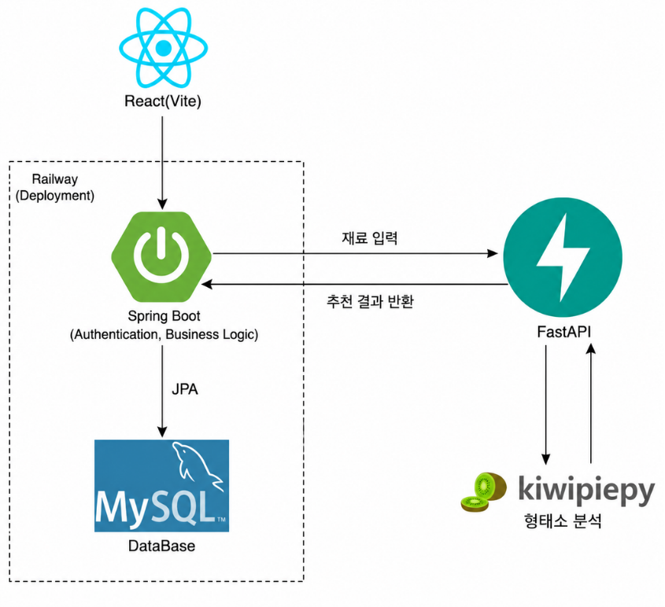
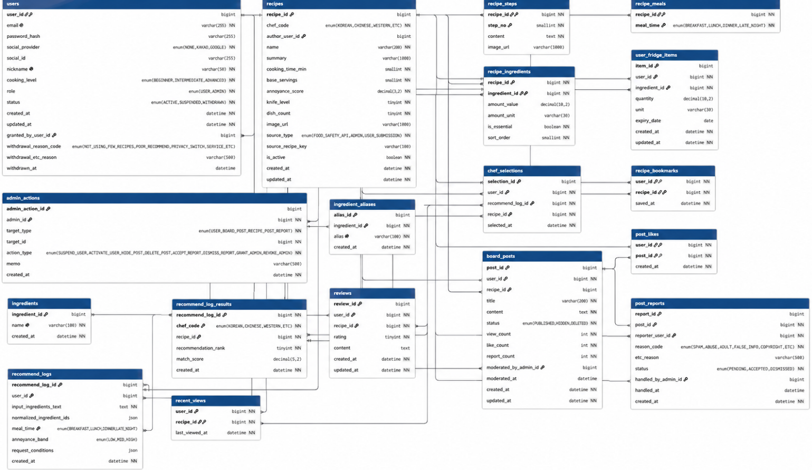

  

# 밀당 (Mealdang)
### 재료 입력 한 줄로 끝내는 오늘의 한 끼 고민

개발기간: 2026.07 ~ 2026.08

 

## 📌 소개

**밀당**은 자취생이 냉장고에 남은 재료를 자연어로 입력하면, 한식·중식·양식 3명의 셰프가 각자의 방식으로 오늘의 한 끼를 동시에 제안하는 웹 서비스입니다.

기존 레시피 서비스들은 대부분 재료를 선택하면 결과를 목록으로 나열하는 방식이라, 오히려 결과가 많을수록 "이 중에 뭘 골라야 하지"라는 새로운 결정 피로를 유발합니다. 밀당은 결과 개수를 늘리는 대신, **3개로 압축된 결과를 사용자가 직접 미세 조정**하는 방향으로 이 문제를 풀었습니다.

> "무엇을 먹을지 정하는 시간"을 줄이는 것이 이 서비스의 유일한 목표입니다.

 

## 팀 소개

| | |                                              | |
|:---:|:---:|:--------------------------------------------:|:---:|
| **Backend** | **Backend** |             **Backend / AI 추천**              | **Frontend** |
| [@yeonci](https://github.com/yeonci) | [@js133](https://github.com/js133) | [@oraorajajo](https://github.com/oraorajajo) | [@Woo0704](https://github.com/Woo0704) |
| 회원 · 레시피 · 마이페이지 · 관리자 | 게시판 · 리뷰 · 나만의 냉장고 |                  추천· 자연어처리                   | 프론트엔드 전반 |

### 🍳 3셰프 동시 비교 추천
같은 재료를 입력해도 한식·중식·양식 3명의 셰프가 각자의 메뉴를 동시에 제안합니다. "재생성"이 아니라 "미세조정" — 마음에 안 들면 처음부터 다시 추천받는 대신, 조건(시간대·조리부담·제외 재료)만 바꿔서 다시 계산합니다.

- 레시피별 **재료준비도(%)** — 내가 가진 재료로 얼마나 만들 수 있는지 정량 표시
- 인식된 재료는 칩(chip)으로 노출, 잘못 인식된 재료는 즉시 삭제·재계산
- 그래도 못 고르겠으면 랜덤 뽑기(룰렛)로 결정

### 🧊 나만의 냉장고
재료명·수량·소비기한을 등록하면 도넛 차트로 유통기한 임박/여유 상태를 한눈에 보여줍니다. 소비기한이 임박한 재료는 메인 화면 상단 배너로 자동 노출되어, 클릭 한 번으로 검색창에 반영됩니다.

### 💬 커뮤니티 게시판
사용자가 직접 레시피를 등록하고, 장르별로 필터링해 다른 사람들의 레시피를 둘러볼 수 있습니다. 등록된 레시피는 검수를 거쳐 게시판에 공개됩니다.

### 🔐 회원 / 소셜 로그인
이메일 회원가입은 물론, 카카오 소셜 로그인도 지원합니다. 탈퇴는 실제 데이터를 삭제하지 않고 상태 전이로 처리해 이력을 보존합니다.

### 🛠 관리자
부적절한 게시글 신고 처리, 회원 정지 등 운영 기능을 제공합니다. 모든 관리자 조치는 로그로 남아 추적할 수 있습니다.

### 📊 마이페이지 (내 담당 셰프)
그동안 어떤 장르를 얼마나 선택했는지, 어떤 시간대에 뭘 골랐는지 통계와 히트맵으로 보여줍니다.

 

## 🏗 아키텍처

프론트엔드가 재료 입력을 Spring Boot로 보내면, Spring Boot는 인증·비즈니스 로직·DB 접근을 전담하고, 형태소 분석이 필요한 부분만 FastAPI에 위임합니다. FastAPI는 DB에 직접 접근하지 않는 stateless 연산 서버로 분리해, 각 서버가 자신의 책임에만 집중하도록 설계했습니다.

 

## 🗂 ERD

총 21개 테이블 · 7개 기능 영역(회원 · 레시피 · 추천 · 나만의 냉장고 · 리뷰 · 커뮤니티 · 즐겨찾기)으로 구성되어 있습니다.

 

## 🧱 기술 스택

**Frontend**

`React 19` `Vite` `Tailwind CSS`

**Backend**

`Spring Boot` `Spring Data JPA` `Spring Security` `JWT` `MySQL`

**AI / 추천 연산**

`FastAPI` `SQLAlchemy` `kiwipiepy (형태소 분석)`

**Infra / Collaboration**

`Railway` `Git` `GitHub`

 

## 🔑 핵심 API

| 도메인 | 엔드포인트 | 설명 |
|---|---|---|
| 회원 | `POST /api/users/signup` `POST /api/users/login` `POST /api/users/login/kakao` | 회원가입 / 로그인 / 카카오 로그인 |
| 추천 | `POST /api/recommend` | 재료 기반 3셰프 추천 |
| 레시피 | `GET/POST /api/recipes` | 레시피 목록 조회 / 등록 |
| 나만의 냉장고 | `GET/POST /api/fridge/items` | 재료 등록 및 소비기한 관리 |
| 게시판 | `GET /api/board/posts` | 커뮤니티 게시글 조회 |
| 마이페이지 | `GET /api/users/me/chef-statistics` | 내 담당 셰프 통계 |
| 관리자 | `PATCH /api/admin/users/{userId}/suspension` | 회원 정지 처리 |
| AI (FastAPI) | `POST /recommend` | 재료 텍스트 형태소 분석 |

 

